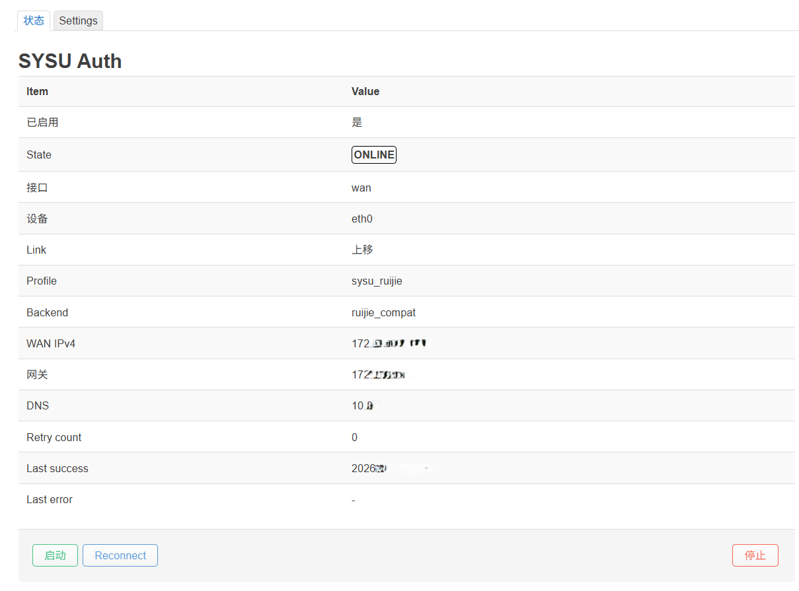
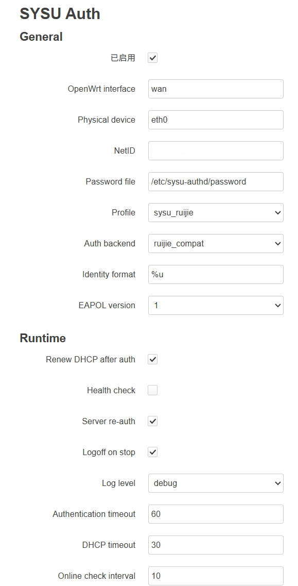

# sysu-authd：中大校园网 OpenWrt 自动认证

> **项目来源与致谢**
>
> 本仓库在 [zjccf/sysu-authd](https://github.com/zjccf/sysu-authd) 原始项目的基础上继续整理和维护。衷心感谢 [@zjccf](https://github.com/zjccf) 完成核心认证程序、OpenWrt 集成思路和原始文档，为本项目奠定了基础。

`sysu-authd` 是一个面向 OpenWrt 的校园网锐捷 / 802.1X 自动认证守护进程，使用 C 语言编写。项目用于中山大学 SYSU 校园网场景，但整体设计尽量把“协议处理”“部署环境 profile”“OpenWrt 集成”拆开，方便后续适配更多学校、更多 OpenWrt 设备和更多认证细节。

它的目标是在路由器上自动完成锐捷的校园网登录认证，并在认证成功后触发 DHCP，让路由器开机后自动联网，这样就可以使用一个校园网账号连接多个设备；同时支持掉线重连、在线状态导出和 LuCI 页面操作。

 


## 功能特性

- 使用原始二层 socket 收发 EAPOL 报文。
- 支持标准 802.1X / EAPOL / EAP-MD5 流程。
- 提供 `standard_eapol` 与 `ruijie_compat` 两个认证后端入口。
- 使用状态机驱动认证、DHCP、在线检查和重试流程。
- 认证成功后可自动触发 OpenWrt WAN DHCP renew。
- 在线后继续监听服务端发起的 EAP 重认证请求。
- 支持 EAPOL-Logoff，便于停止服务时释放认证会话。
- 支持 UCI 配置、procd 守护、syslog 日志、ubus 状态接口和 LuCI 页面。
- 密码不写入主配置文件，建议单独保存到 root-only 权限文件。
- 状态导出经过脱敏，不暴露密码、challenge、response 或认证摘要。

## 工作原理

```text
OpenWrt 启动
  -> procd 启动 sysu-authd
  -> 读取 /etc/config/sysu-authd 并生成运行时配置
  -> 读取 NetID 和 password_file
  -> 等待 WAN 物理链路 up
  -> 打开绑定到 WAN 物理设备的 raw socket
  -> 发送 EAPOL-Start
  -> 回复 EAP Request Identity
  -> 回复 EAP Request MD5-Challenge
  -> 收到 EAP Success
  -> 触发 WAN DHCP renew
  -> 检查 WAN IPv4 地址和默认路由
  -> 进入 ONLINE
  -> watchdog 持续检查链路、认证后端和网络状态
```

## 项目结构

主要目录：

```text
src/                     C 源码
openwrt/                 核心 OpenWrt 软件包、UCI 默认配置和 procd 启动脚本
luci-app-sysu-authd/     符合 LuCI 目录规范的独立网页管理软件包
scripts/                 构建、检查和 SDK 暂存脚本
docs/                    示例配置
```

核心守护进程与 LuCI 网页管理界面是两个独立软件包：

- `sysu-authd` 只依赖基础系统，可独立安装和运行。
- `luci-app-sysu-authd` 依赖 `sysu-authd`、`rpcd` 和 `luci-base`，使用标准的 `luci.mk` 构建方式。

## 仓库名称说明

当前仓库同时包含核心守护进程和可选的 LuCI 管理界面，因此保留 `sysu-authd` 作为仓库名称更准确。只有在将网页界面拆分为完全独立的仓库时，才建议把该独立仓库命名为 `luci-app-sysu-authd`。


## OpenWrt SDK 交叉编译

推荐使用目标设备对应版本的 OpenWrt SDK 构建。请尽量选择与路由器固件版本、目标平台、libc 和架构一致的 SDK，否则生成的二进制或 `.ipk` 可能无法安装或运行。

### 方法一：使用 OpenWrt SDK 原生包构建（推荐）

使用辅助脚本把核心守护进程和可选的 LuCI 软件包暂存成 SDK 能识别的两个独立软件包：

```sh
cd /path/to/sysu-authd
SDK=/path/to/openwrt-sdk ./scripts/stage-openwrt-packages.sh

cd /path/to/openwrt-sdk
make package/sysu-authd/clean package/sysu-authd/compile V=s
make package/luci-app-sysu-authd/clean package/luci-app-sysu-authd/compile V=s
```

只构建核心守护进程，跳过 LuCI 与 rpcd 依赖：

```sh
SDK=/path/to/openwrt-sdk WITH_LUCI=0 ./scripts/stage-openwrt-packages.sh
```

目标目录已存在时脚本会停止，避免覆盖已有包。确认要替换先前暂存的副本时可加 `FORCE=1`。

也可以把整个仓库直接克隆到 `SDK/package/sysu-authd`；根目录 `Makefile` 会在 OpenWrt 构建环境中自动载入核心软件包定义。此方式只提供核心守护进程；LuCI 软件包请使用上面的暂存脚本。

构建产物通常会出现在 SDK 的：

```text
bin/packages/<arch>/base/
bin/packages/<arch>/luci/
```

如果需要 LuCI 包，请确保 SDK 中有 LuCI feed，且已安装相关 feed 索引。

`luci-app-sysu-authd` 使用 LuCI 官方的 `luci.mk` 构建机制。如果暂存脚本提示找不到 `feeds/luci/luci.mk`，请先更新并安装 LuCI feed，或者使用 `WITH_LUCI=0` 只构建核心守护进程。

### 方法二：使用项目内通用交叉编译脚本

项目提供了一个轻量脚本，可直接调用 SDK toolchain 编译并生成 gzip-tar 风格的 `.ipk`：

```sh
SDK=/path/to/openwrt-sdk ./scripts/build-openwrt.sh
```

只生成核心守护进程软件包：

```sh
SDK=/path/to/openwrt-sdk BUILD_LUCI=0 ./scripts/build-openwrt.sh
```

默认输出目录：

```text
dist/openwrt/
```

输出包括：

```text
sysu-authd
sysu-authd_<version>-<release>_<arch>.ipk
luci-app-sysu-authd_<version>-<release>_all.ipk
```

脚本会从 SDK 的 `staging_dir/toolchain-*` 和 `staging_dir/target-*` 尽量自动推断交叉编译器、target staging 和包架构。不同 SDK 的目录命名可能不同，必要时可以手动指定：

```sh
SDK=/path/to/openwrt-sdk \
TOOLCHAIN=/path/to/openwrt-sdk/staging_dir/toolchain-xxx \
TARGET_STAGING=/path/to/openwrt-sdk/staging_dir/target-xxx \
TARGET_CROSS=mipsel-openwrt-linux-musl- \
PKG_ARCH=mipsel_24kc \
OUT_DIR=dist/mipsel_24kc \
./scripts/build-openwrt.sh
```

常用变量：

```text
SDK             OpenWrt SDK 根目录，必填
TOOLCHAIN       toolchain staging 目录，通常可自动推断
TARGET_STAGING  target staging 目录，通常可自动推断
TARGET_CROSS    交叉编译前缀，例如 arm-openwrt-linux-muslgnueabi-
PKG_ARCH        opkg 包架构名，例如 arm_cortex-a7_neon-vfpv4、mipsel_24kc
OUT_DIR         输出目录
BUILD_LUCI      是否生成 LuCI 包，1（默认）或 0
PKG_VERSION     包版本，默认 0.1.0
PKG_RELEASE     包 release，默认 1
```

如果不确定 `PKG_ARCH`，可以在目标路由器上查看：

```sh
opkg print-architecture
```

选择优先级最高、与当前固件匹配的架构名。

## OpenWrt 安装

把生成的 `.ipk` 上传到路由器：

```sh
ROUTER=192.168.1.1
scp dist/openwrt/sysu-authd_*.ipk root@$ROUTER:/tmp/
scp dist/openwrt/luci-app-sysu-authd_*.ipk root@$ROUTER:/tmp/
```

在路由器上安装：

```sh
opkg install /tmp/sysu-authd_*.ipk
opkg install /tmp/luci-app-sysu-authd_*.ipk
```

如果只需要守护进程，可以不安装 `luci-app-sysu-authd`。ubus 适配器与网页界面一起放在 LuCI 软件包中，因此不安装该包时请直接使用启动脚本和状态文件。

## OpenWrt 配置

默认 UCI 配置位于：

```text
/etc/config/sysu-authd
```

建议把密码单独保存到：

```text
/etc/sysu-authd/password
```

示例：

```sh
mkdir -p /etc/sysu-authd
printf '%s\n' '你的校园网密码' >/etc/sysu-authd/password
chmod 0600 /etc/sysu-authd/password

uci set sysu-authd.main.enabled='1'
uci set sysu-authd.main.interface='wan'
uci set sysu-authd.main.device='eth0'
uci set sysu-authd.main.username='你的NetID'
uci set sysu-authd.main.password_file='/etc/sysu-authd/password'
uci set sysu-authd.main.profile='sysu_ruijie'
uci set sysu-authd.main.auth_backend='ruijie_compat'
uci set sysu-authd.main.identity_format='%u'
uci set sysu-authd.main.eapol_version='1'
uci commit sysu-authd

/etc/init.d/sysu-authd enable
/etc/init.d/sysu-authd restart
```

重要配置项：

```text
enabled                     是否启用服务
interface                   OpenWrt 逻辑接口，通常是 wan
device                      物理网卡设备，例如 eth0、eth1、wan
username                    校园网 NetID
password_file               密码文件路径
profile                     部署 profile，默认 sysu_ruijie
auth_backend                认证后端，默认 ruijie_compat
identity_format             身份格式，%u 会替换为 username
eapol_version               EAPOL 版本，通常为 1 或 2
dhcp_after_success          认证成功后是否触发 DHCP
healthcheck_enable          是否启用在线检查
logoff_on_stop              停止时是否发送 EAPOL-Logoff
reauth_enable               在线后是否响应服务端重认证
retry_initial               初始重试退避秒数
retry_max                   最大重试退避秒数
retry_forever               是否持续重试
log_level                   error / warn / info / debug
auth_timeout_sec            认证超时
dhcp_timeout_sec            DHCP 等待超时
online_check_interval_sec   在线检查间隔
tick_interval_msec          状态机 tick 间隔
```

`device` 很关键，它应该是实际承载 EAPOL 的物理设备，而不仅仅是 OpenWrt 里的逻辑接口名。可以用下面命令辅助确认：

```sh
uci get network.wan.device
ubus call network.interface.wan status
ip link
```

## 运行和观测

服务管理：

```sh
/etc/init.d/sysu-authd start
/etc/init.d/sysu-authd stop
/etc/init.d/sysu-authd restart
/etc/init.d/sysu-authd enable
```

日志：

```sh
logread -f -e sysu-authd
```

`sysu-authd` 写入 OpenWrt syslog。默认 OpenWrt 的 `logd` 使用内存环形缓冲区，旧日志会在缓冲区满时自动被覆盖；本程序不会自行创建或删除日志文件。

状态文件：

```sh
cat /var/run/sysu-authd.status
```

ubus：

```sh
ubus list | grep sysu-authd
ubus call sysu-authd status
ubus call sysu-authd reconnect
ubus call sysu-authd stop
ubus call sysu-authd start
```

LuCI：

```text
Network > SYSU Auth
```

如果安装 LuCI 包后菜单没有出现，可以刷新缓存：

```sh
rm -f /tmp/luci-indexcache
rm -rf /tmp/luci-modulecache/
/etc/init.d/rpcd restart
/etc/init.d/uhttpd restart
```

## 真实网络测试建议

第一次在真实网络测试时，建议先前台运行，确认日志：

```sh
/usr/sbin/sysu-authd --config /var/run/sysu-authd.conf --foreground
```

更常用的是通过 init 脚本启动：

```sh
/etc/init.d/sysu-authd restart
logread -f -e sysu-authd
```

测试重点：

- WAN 网线接入后是否进入 `WAIT_LINK -> PREPARE_INTERFACE`。
- 是否发送 `EAPOL-Start`。
- 是否收到 `EAP Request Identity`。
- 是否收到 `EAP Request MD5-Challenge`。
- 是否收到 `EAP Success`。
- 是否进入 `DHCP_RENEWING`。
- WAN 是否获得 IPv4、默认路由和 DNS。
- 是否最终进入 `ONLINE`。
- 拔插网线、重启服务、手动 reconnect 后是否能恢复。

如果认证失败，建议检查：

- `device` 是否是真正的 WAN 物理设备。
- `username` 是否需要后缀，例如 `%u@xxx`。
- `eapol_version` 应该用 `1` 还是 `2`。
- 密码文件是否存在，权限是否为 `0600`。
- 交换机是否真的发送 EAPOL/EAP-MD5，而不是其他 EAP method。
- 是否需要额外锐捷私有 keepalive 或客户端兼容字段。

## 安全说明

- 不要把密码直接写进 `/etc/config/sysu-authd`。
- `password_file` 应设置为 root 可读写，推荐权限 `0600`。
- 日志不会打印密码。
- ubus/LuCI 状态不会导出密码、challenge、response 或认证摘要。
- 抓包、debug 日志和 issue 反馈中请自行去除账号、MAC、IP、challenge/response 等敏感信息。

## 许可证

本仓库由 Qianli Ma 及后续贡献者创作的新增内容采用 [MIT 许可证](LICENSE)。

本项目包含源自 [zjccf/sysu-authd](https://github.com/zjccf/sysu-authd) 的代码和文档；其版权仍归原作者所有。由于上游仓库目前未公布许可证，本仓库的 MIT 许可证不代表对上游内容进行重新授权。若要分发或在其他项目中使用完整代码，请同时确认已获得上游作者的许可。

## 当前限制

- 当前真实认证路径主要覆盖标准 EAPOL + EAP-MD5。
- `ruijie_compat` 已预留扩展入口，但私有锐捷保活和兼容字段需要根据真实抓包继续适配。
- DHCP renew 依赖 OpenWrt 的 `ifup <interface>` 行为。
- LuCI 当前提供状态、服务操作和配置编辑，暂未提供最近日志页面。
